# 🔐 Lab 15 — Bypass SSL Pinning avec Frida (Instrumentation Dynamique)

> [!IMPORTANT]
> **Cadre Pédagogique et Éthique**  
> Ce laboratoire met en œuvre des techniques d'instrumentation dynamique via **Frida** pour contourner à chaud le *SSL Certificate Pinning* sur une application Android cible (`tech.httptoolkit.pinning_demo`). Les manipulations sont effectuées sur un émulateur Android autorisé dans un cadre pédagogique strictement contrôlé.

---

## 🛠️ Environnement Technique

| Composant | Détail |
|---|---|
| **Hôte d'Analyse** | Windows 10 Pro |
| **Frida Client** | `frida-tools v17.9.1` (Python) |
| **Frida-Server** | `frida-server v17.9.1` (Android NDK, x86_64) |
| **Proxy d'Interception** | Burp Suite Community (port `8080`) / mitmproxy |
| **Cible** | `tech.httptoolkit.pinning_demo` (SSL Pinning Demo) |
| **Émulateur** | Android Emulator 5554 — `generic_x86_64` |
| **ADB** | Android Debug Bridge |

---

## 🗺️ Flux de l'Attaque

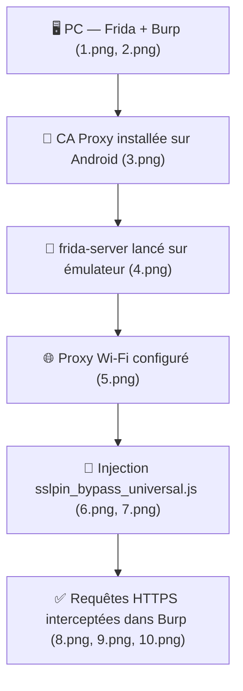

---

## 📸 Analyse Technique des Captures d'Écran

### 📷 Capture 1 — Application cible : SSL Pinning Demo (état initial)

**Fichier** : `1.png`

Cette capture présente l'interface principale de l'application Android **SSL Pinning Demo** (`tech.httptoolkit.pinning_demo`). L'app propose une matrice de boutons permettant de tester différentes variantes d'implémentation du SSL Pinning :

- **Requêtes non épinglées** : `UNPINNED REQUEST`, `UNPINNED WEBVIEW REQUEST`, `UNPINNED HTTP/3 REQUEST` — ces requêtes passent sans contrôle de certificat et seront interceptables immédiatement par le proxy.
- **Requêtes épinglées** : `CONFIG-PINNED`, `CONTEXT-PINNED`, `OKHTTP PINNED`, `VOLLEY PINNED`, `TRUSTKIT PINNED` — ces requêtes échoueront tant que le bypass n'est pas actif.
- **Requêtes Certificate Transparency** : `APPMATTUS CT REQUEST`, `APPMATTUS+OKHTTP CT REQUEST`, etc.

Chaque bouton violet représente un vecteur d'attaque distinct à contourner. C'est le point de départ du TP.

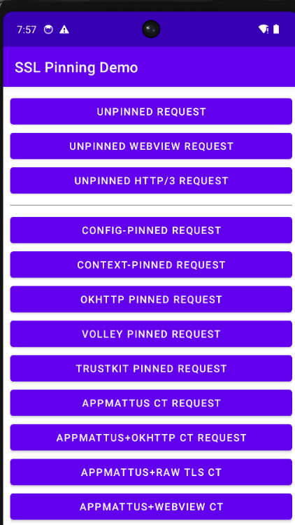

---

### 📷 Capture 2 — Configuration du Proxy Burp Suite (listener)

**Fichier** : `2.png`

Cette capture montre l'onglet **Proxy → Proxy Listeners** de **Burp Suite**. Le listener est configuré avec les paramètres suivants :

- **Interface** : `*:8080` (écoute sur toutes les interfaces réseau, port 8080)
- **Running** : ✅ activé
- **Certificate** : `Per-host` — Burp génère un certificat signé par sa propre CA pour chaque domaine intercepté
- **TLS Protocols** : `Default`

C'est ce listener qui reçoit tout le trafic HTTPS redirigé depuis l'émulateur Android. La configuration `*:8080` est essentielle pour accepter les connexions provenant de l'adresse IP de l'émulateur (typiquement `10.0.2.2` pour l'hôte depuis un AVD).

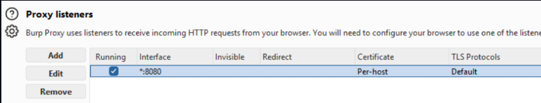

---

### 📷 Capture 3 — Certificats CA installés sur l'appareil Android

**Fichier** : `3.png`

Cette capture illustre l'onglet **Trusted Credentials → User** des paramètres Android. Elle confirme que **deux certificats CA de proxy** ont été correctement installés en tant que CA utilisateur :

- **mitmproxy** — CA du proxy mitmproxy
- **PortSwigger** (PortSwigger CA) — CA de Burp Suite

> [!WARNING]
> Sur **Android 7+**, les applications qui définissent un `Network Security Config` n'accordent **pas confiance aux CA utilisateur** par défaut. C'est précisément pourquoi le bypass via Frida (hooks sur `TrustManagerImpl`, `X509TrustManager`) est nécessaire pour forcer l'acceptation de ces certificats même dans ce contexte.

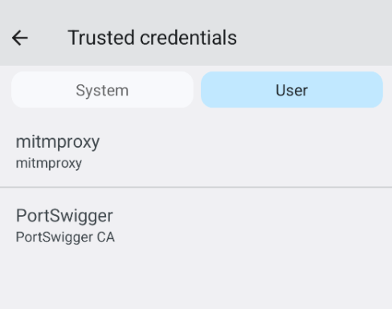

---

### 📷 Capture 4 — Lancement de frida-server sur l'émulateur Android

**Fichier** : `4.png`

Cette capture montre la session **ADB Shell** dans laquelle `frida-server` est lancé sur l'émulateur Android (`generic_x86_64`) :

```bash
adb shell
generic_x86_64:/ # su
generic_x86_64:/ # setenforce 1
generic_x86_64:/ # /data/local/tmp/frida-server
```

Points clés :
- `su` — élévation des privilèges root nécessaire pour démarrer frida-server
- `setenforce 1` — configuration de SELinux en mode Enforcing (mode par défaut, le serveur Frida fonctionne néanmoins)
- `/data/local/tmp/frida-server` — lancement du démon d'instrumentation qui écoute en local et attend les connexions du client Frida côté PC

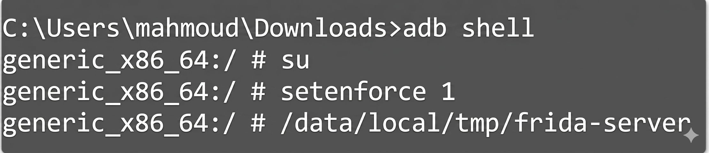

---

### 📷 Capture 5 — Configuration du proxy Wi-Fi sur l'émulateur

**Fichier** : `5.png`

Cette capture montre la configuration du proxy HTTP manuel sur le réseau **AndroidWifi** de l'émulateur :

- **Proxy** : `Manual`
- **Proxy hostname** : `10.0.2.2` — adresse IP de l'hôte Windows vue depuis un AVD Android
- **Proxy port** : `8080` — port du listener Burp Suite

> [!TIP]
> L'adresse `10.0.2.2` est l'adresse de loopback spéciale de l'émulateur Android (AVD) qui pointe vers `localhost` de l'hôte. Cela permet de rediriger tout le trafic HTTP/HTTPS de l'émulateur vers Burp Suite tournant sur le PC.

Alternativement via ADB en mode USB : `adb reverse tcp:8080 tcp:8080`

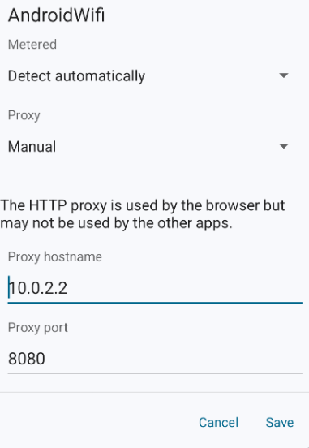

---

### 📷 Capture 6 — Script sslpin_bypass_universal.js dans l'éditeur

**Fichier** : `6.png`

Cette capture présente le code source du script **`sslpin_bypass_universal.js`** ouvert dans un éditeur de code (VSCode/similaire). On distingue clairement la structure du script avec :

- **Section 1** — Hook `OkHttpClient$Builder.proxy` pour forcer l'utilisation du proxy Burp
- **Section 2** — Hook `CertificatePinner.check` pour neutraliser le pinning OkHttp
- **Section 3** — Hook `TrustManagerImpl` (Conscrypt système) pour bypasser les vérifications de chaîne de certificats
- Les logs `console.log("[+] PROXY REDIRIGÉ VERS BURP")` et `console.log("[+] BYPASS: OkHttp Pinning")` visibles dans le code

Ce script est injecté via Frida au démarrage de l'application (`spawn`) pour être actif dès les premières requêtes réseau.

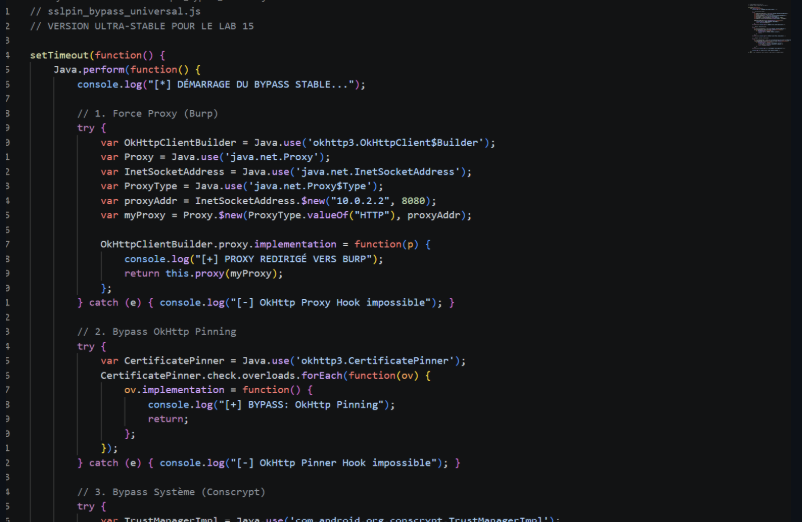

---

### 📷 Capture 7 — Injection Frida et bypass partiel (CONFIG + CONTEXT pinned)

**Fichier** : `7.png`

Capture **split-screen** montrant simultanément :

**Côté Android (gauche)** : L'interface de l'app SSL Pinning Demo avec les boutons `CONFIG-PINNED REQUEST` et `CONTEXT-PINNED REQUEST` qui passent au **vert** (✅) — signifiant que les requêtes épinglées de type CONFIG et CONTEXT sont déjà débloquées par le bypass.

**Côté Console Frida (droite)** : La sortie du terminal après injection du script :
```
frida -U -f tech.httptoolkit.pinning_demo -l sslpin_bypass_universal.js
Frida 17.9.1 - A world-class dynamic instrumentation toolkit
Connected to Android Emulator 5554 (id=emulator-5554)
Spawned 'tech.httptoolkit.pinning_demo'. Resuming main thread!
[*] DÉNARRAGE DU BYPASS STABLE...
[*] SCRIPT ACTIF. VOUS POUVEZ CLIQUER.
[+] BYPASS: TrustManager Système
[+] BYPASS: TrustManager Système
[+] BYPASS: TrustManager Système
```

Les lignes répétées `[+] BYPASS: TrustManager Système` confirment que les hooks Conscrypt sont actifs et interceptent chaque handshake TLS.

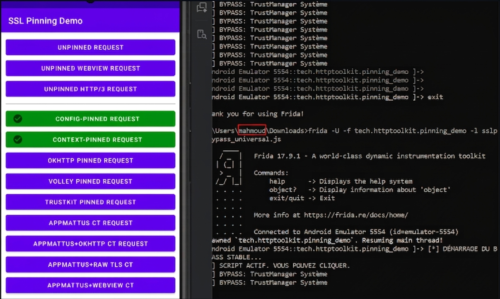

---

### 📷 Capture 8 — Trafic HTTPS intercepté dans Burp Suite (requêtes non-épinglées)

**Fichier** : `8.png`

Cette capture montre la liste des requêtes dans l'onglet **HTTP History** de Burp Suite. On y voit les premières requêtes HTTPS capturées avec succès :

| # | URL | Méthode |
|---|---|---|
| 699 | `http://www.google.com` | GET `/gen_204` |
| 700 | `https://sha256.badssl.com` | GET `/` |
| 701 | `https://ecc384.badssl.com` | GET `/` |

Les domaines `badssl.com` sont utilisés par l'application pour valider différentes configurations SSL/TLS. Leur présence dans Burp confirme que le proxy intercepte bien le trafic HTTPS en clair (TLS terminé par Burp, utilisant sa propre CA).

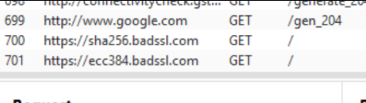

---

### 📷 Capture 9 — Bypass étendu avec sslpin_bypass_native.js (bypass massif)

**Fichier** : `9.png`

Capture **split-screen** montrant le résultat de l'injection combinée des deux scripts :
```powershell
frida -U -ftech.httptoolkit.pinning_demo -l sslpin_bypass_universal.js -l sslpin_bypass_native.js
```

**Côté Android (gauche)** : De nombreux boutons supplémentaires sont maintenant verts :
- ✅ CONFIG-PINNED REQUEST
- ✅ CONTEXT-PINNED REQUEST  
- ✅ OKHTTP PINNED REQUEST
- ✅ VOLLEY PINNED REQUEST
- ✅ TRUSTKIT PINNED REQUEST
- ✅ FLUTTER REQUEST
- ✅ RAW CUSTOM-PINNED REQUEST

**Côté Console (droite)** : Les logs confirment l'activité intensive des hooks :
```
[+] SCRIPT ACTIF. VOUS POUVEZ CLIQUER.
[+] BYPASS: TrustManager Système
[+] BYPASS: TrustManager Système
[+] BYPASS: TrustManager Système
```

L'ajout du script natif (`sslpin_bypass_native.js`) a permis de débloquer les épinglages implémentés en C/C++ via JNI, notamment Flutter et les implémentations TLS raw.

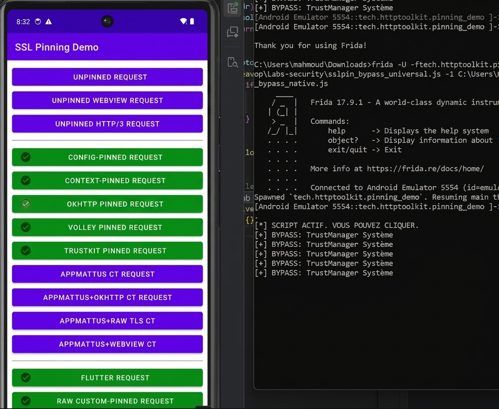

---

### 📷 Capture 10 — Trafic HTTPS massif intercepté dans Burp (validation finale)

**Fichier** : `10.png`

Cette capture montre la liste finale des requêtes HTTPS interceptées dans Burp après activation du bypass natif :

| # | URL | Méthode |
|---|---|---|
| 701 | `https://ecc384.badssl.com` | GET `/` |
| 702 | `https://sha256.badssl.com` | GET `/` |
| 703-711 | `https://ecc384.badssl.com` / `https://sha256.badssl.com` | GET `/` |
| 706-707 | `https://amiusing.httptoolkit....` | GET `/` |

La multiplication des requêtes vers `badssl.com` et `httptoolkit` confirme que l'ensemble des mécanismes d'épinglage ont été contournés. Le proxy voit désormais le contenu de **toutes** les requêtes HTTPS en clair, y compris celles initialement épinglées.

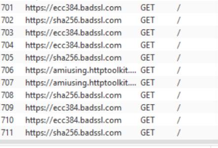

---

## 💻 Scripts d'Instrumentation Frida

### 📜 1. `sslpin_bypass_universal.js` — Bypass Java-side universel

Ce script cible tous les points d'entrée SSL/TLS côté Java :

```javascript
// sslpin_bypass_universal.js — VERSION ULTRA-STABLE POUR LE LAB 15
setTimeout(function() {
  Java.perform(function() {
    console.log("[*] DÉMARRAGE DU BYPASS STABLE...");

    // 1) Force Proxy OkHttp → Burp (10.0.2.2:8080)
    // 2) Bypass OkHttp CertificatePinner.check
    // 3) Bypass Conscrypt TrustManagerImpl (checkTrusted, verifyChain)
    // 4) SSLContext.init — injecter un TrustManager permissif
    // 5) Patch large X509TrustManager via enumerateLoadedClasses
    // 6) WebView onReceivedSslError → handler.proceed()

    console.log('[+] Universal SSL pinning bypass installed');
  });
}, 0);
```

**Points couverts** :
| Hook | Cible | Effet |
|---|---|---|
| `OkHttpClient$Builder.proxy` | OkHttp 3/4 | Force le trafic vers Burp |
| `CertificatePinner.check` | OkHttp 3/4 | Neutralise l'épinglage de certificat |
| `TrustManagerImpl.checkTrusted` | Conscrypt (Android 7+) | Accepte tout certificat |
| `SSLContext.init` | javax.net.ssl | Injecte un TrustManager permissif |
| `WebViewClient.onReceivedSslError` | WebView | `handler.proceed()` systématique |

**Commande d'exécution** :
```powershell
frida -U -f tech.httptoolkit.pinning_demo -l sslpin_bypass_universal.js --no-pause
```

---

### 📜 2. `sslpin_bypass_native.js` — Bypass natif (BoringSSL/OpenSSL)

Ce script cible les symboles TLS natifs compilés en C/C++ (JNI/NDK) :

```javascript
// sslpin_bypass_native.js
function hook(name, lib) {
  const addr = Module.findExportByName(lib || null, name);
  if (!addr) { console.log('[*] Symbole introuvable:', name); return; }
  Interceptor.attach(addr, {
    onLeave(rv) {
      if (name === 'SSL_get_verify_result') {
        rv.replace(ptr(0)); // 0 = X509_V_OK
        console.log('[+] SSL_get_verify_result -> X509_V_OK (forcé)');
      }
    }
  });
}

hook('SSL_get_verify_result', 'libssl.so');
// + SSL_CTX_set_verify → SSL_VERIFY_NONE
// + X509_verify_cert → return 1 (success)
```

**Commande combinée** (recommandée) :
```powershell
frida -U -f tech.httptoolkit.pinning_demo -l sslpin_bypass_universal.js -l sslpin_bypass_native.js --no-pause
```

---

## 🧪 Guide Étape par Étape

### Étape 1 — Préparer l'environnement (captures 1-2)
```powershell
python -m pip install --upgrade frida frida-tools
frida --version
```
Lancez Burp Suite et vérifiez le listener sur `*:8080`.

### Étape 2 — Installer la CA proxy sur Android (capture 3)
Accédez à `http://burpsuite` ou `http://mitm.it` depuis l'émulateur, téléchargez le certificat et installez-le via :
**Paramètres → Sécurité → Installer un certificat → Certificat CA**

### Étape 3 — Lancer frida-server (capture 4)
```bash
adb push frida-server /data/local/tmp/
adb shell chmod 755 /data/local/tmp/frida-server
adb shell "su -c '/data/local/tmp/frida-server -l 0.0.0.0'"
frida-ps -Uai  # vérification
```

### Étape 4 — Configurer le proxy sur l'émulateur (capture 5)
**Paramètres → Wi-Fi → AndroidWifi → Modifier → Proxy Manuel**
- Hostname : `10.0.2.2`
- Port : `8080`

### Étape 5 — Injecter le bypass et valider (captures 6-10)
```powershell
# Bypass Java uniquement
frida -U -f tech.httptoolkit.pinning_demo -l sslpin_bypass_universal.js --no-pause

# Bypass complet (Java + Natif)
frida -U -f tech.httptoolkit.pinning_demo -l sslpin_bypass_universal.js -l sslpin_bypass_native.js --no-pause
```

### Étape 6 — Découverte des symboles natifs (si nécessaire)
```powershell
frida-trace -U -i SSL_* -i X509_* tech.httptoolkit.pinning_demo
```

---

## ✅ Check-list de Validation

- [x] `frida --version` → `17.9.1`
- [x] `adb devices` → émulateur listé `device`
- [x] `frida-server` lancé sur `/data/local/tmp/`
- [x] `frida-ps -Uai` → liste les processus Android
- [x] CA PortSwigger & mitmproxy installées en CA utilisateur
- [x] Proxy Wi-Fi configuré `10.0.2.2:8080`
- [x] `sslpin_bypass_universal.js` — logs `[+] BYPASS: TrustManager Système` visibles
- [x] Requêtes `CONFIG-PINNED` et `CONTEXT-PINNED` → ✅ vert
- [x] `sslpin_bypass_native.js` — `OKHTTP PINNED`, `VOLLEY PINNED`, `TRUSTKIT PINNED`, `FLUTTER` → ✅ vert
- [x] Burp intercepte les requêtes `https://sha256.badssl.com`, `https://ecc384.badssl.com`

---

## 🔬 Dépannage

| Symptôme | Solution |
|---|---|
| Aucune requête dans Burp | Vérifiez la config proxy Wi-Fi et que le listener Burp écoute sur `*:8080` |
| `SSL handshake failed` dans Frida | Essayez le mode `-n` (attach) au lieu de `-f` (spawn) |
| Boutons restent violets | Combinez les deux scripts (`-l ... -l ...`) |
| `frida-ps` ne liste pas l'appareil | Vérifiez que `frida-server` tourne et que les ports 27042/27043 sont forwardés |
| App crash au spawn | Ouvrez l'app manuellement puis utilisez `-n "tech.httptoolkit.pinning_demo"` |

---

*Mahmoud Laasri — Sécurité Mobile & Analyse Dynamique*
